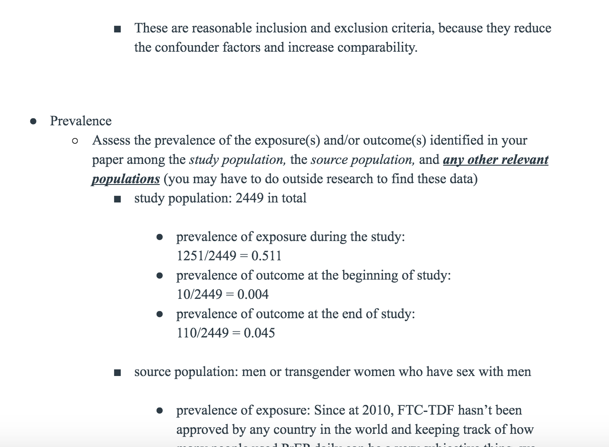

### I have a webpage!

And I can put all kinds of stuff on it!

I can add additional text. 

I *could* write some code but im not going to. 

## Add some links 

I like [to look for code](https://www.google.com)

I can link directly to my [about page](about.html)

### Picture of my dog 

Great!

### I can add code 

My code page is [here](code.html) 

### This is my Resume 

My Resume page is [here](resume.html)  

